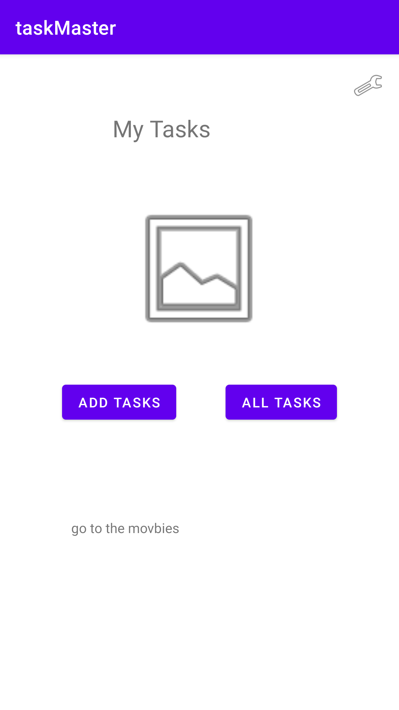
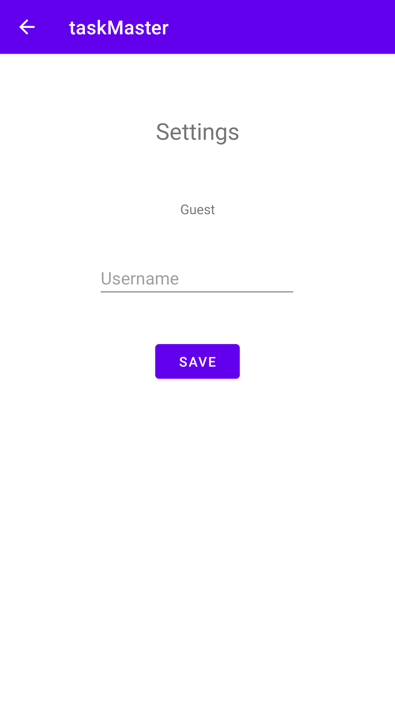
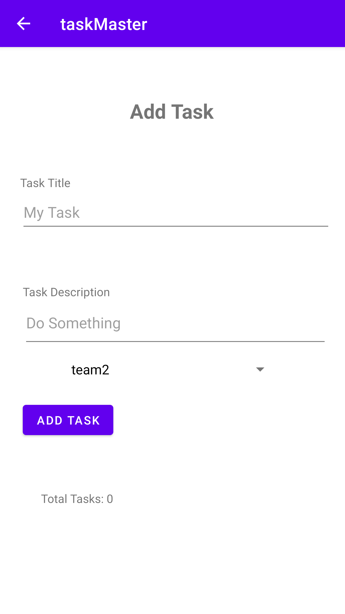
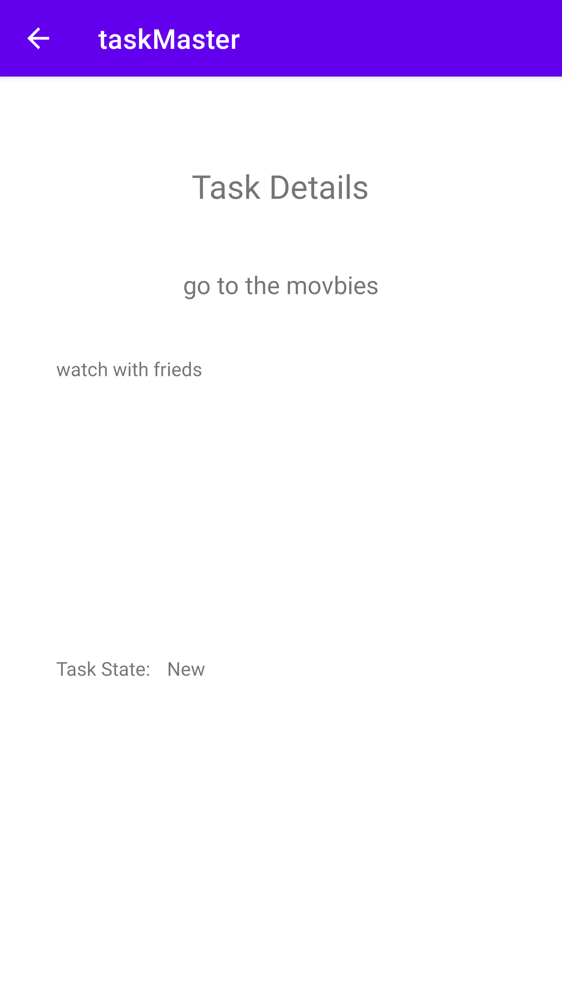

# Task Manager

## Daily Change Log

- 4/26/21 :
    - Set up home page, add tasks page and all tasks page. Added navigation between the pages, functionality to the "Add Task" button.
    "Submitted!" is displayed when the button is pushed.

- 4/27/21
    - Set up the settings page using shared preferences to save the username and apply it to the settings page and the home page.
    - Set up the Task Detail page, and created three buttons on the home page all of which take the user to the taskItem detail page.
        - Each of the buttons displays a different taskItem title, and displays that title on the taskItem detail page when clicked.

-4/28/21
    - Implemented a RecyclerView on the home page that displays the hardcoded tasks, and takes the user to the taskItem detail page when clicked on.

-4/29/21
    - Implemented Room database usage in the app. Store Task instances in the database, populating the RecyclerView on the home page with taskItem titles from
    database, and then displaying the taskItem title, description, and state on the Task Detail page.

-5/7/21
    - Started the process to get the app on the google play store. App is in internal testing phase right now.

## Screenshots

- 4/26/21

- 4/27/21

- 4/28/21

- 5/7/21

